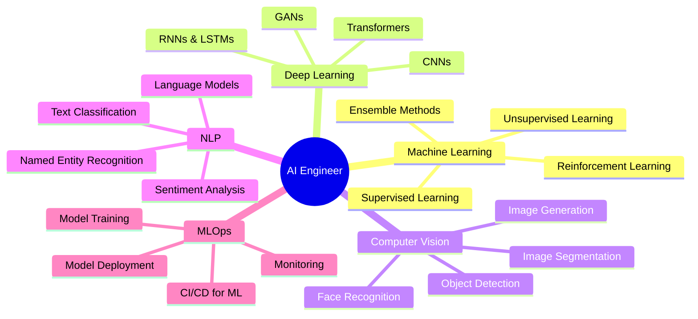

<div align="center">

# 💫 ULFIYAH RUSTAM
## AI & Machine Learning Engineer


[](https://git.io/typing-svg)

**Contact:** 73033  
**Email:** ulfiah525363@gmail.com

</div>

---

## 🎯 About Me

<table>
<tr>
<td width="60%">

```python
class AIEngineer:
    def __init__(self):
        self.name = "Ulfiyah Rustam (Ulfi)"
        self.role = "AI & ML Engineer"
        self.age = 19
        self.education = "Undergraduate Student"
        self.passion = [
            "Artificial Intelligence",
            "Machine Learning",
            "Deep Learning",
            "Computer Vision",
            "Natural Language Processing"
        ]
        self.motto = "Teaching machines to think! 🤖"
    
    def current_focus(self):
        return {
            "learning": "Advanced AI Models",
            "building": "ML Projects",
            "exploring": "Latest AI Research"
        }

ai_engineer = AIEngineer()
print(f"Hi! I'm {ai_engineer.name} 👋")
print("Passionate about creating intelligent systems")
print("that solve real-world problems! ✨")
```

</td>
<td width="40%">

### 🔗 Social Media

[](https://github.com/Ms-Ulfiyahrustam)

[](https://instagram.com/ulfiyahrustam_)

[](https://linkedin.com)

[](https://huggingface.co/URS23)

[](https://kaggle.com/ulfiyah)

[](#)
**Discord:** ms.nzmia

</td>
</tr>
</table>

---

<table>
<tr>
<td width="50%">

## 🎓 Education

```yaml
Academic Background:
  - 🌟 10th CBSE
  - 🌟 12th CBSE
  - 🎓 BA Delhi University
  - 🎨 Graphic Design at Dice Academy
  - 🤖 AI & ML Specialization at Dice Academy
  - 📊 Data Science Bootcamp
  - 🧠 Deep Learning Courses

Certifications:
  - ✨ Machine Learning (Coursera)
  - ✨ Deep Learning Specialization
  - ✨ TensorFlow Developer Certificate
  - ✨ AWS ML Fundamentals
```

</td>
<td width="50%">

## 💼 Skills

### 🤖 AI/ML Skills


</td>
</tr>
</table>

---

## 💻 Programming Languages & Frameworks

<div align="center">

### Languages


### AI/ML Frameworks


### Data Science Tools


</div>

---

## 🗄️ Databases & Cloud

<div align="center">

### Databases


### Cloud & MLOps


</div>

---

<table>
<tr>
<td width="50%">

## 🎨 Hobbies

<div align="center">

| Activity | Description |
|----------|-------------|
| 🎵 | **Music** - Lo-fi & Electronic |
| 📚 | **Reading** - AI Research Papers |
| 🎮 | **Gaming** - Strategy Games |
| 📷 | **Photography** - Capturing moments |
| 🎬 | **Movies** - Sci-Fi & Tech |
| ✍️ | **Writing** - Tech Blogs |
| 🎨 | **Design** - UI/UX & Graphics |
| 🧩 | **Puzzles** - Problem Solving |

</div>

### Personal Interests
```python
hobbies = {
    "creative": ["Graphic Design", "Digital Art"],
    "technical": ["Open Source", "Kaggle Competitions"],
    "learning": ["AI Research", "New Technologies"],
    "community": ["Tech Meetups", "Mentoring"],
    "relaxation": ["Music", "Reading", "Gaming"]
}
```

</td>
<td width="50%">

## 🛠️ Tools & Technologies

<div align="center">

### Development Tools


### Design Tools


</div>

</td>
</tr>
</table>

---

## 🚀 What I'm Currently Working On

<div align="center">

```python
current_projects = {
    "AI Research": [
        "🔬 Exploring Large Language Models (LLMs)",
        "🎯 Computer Vision for Object Detection",
        "💬 Building Chatbots with RAG Architecture",
        "🖼️ Image Generation with Diffusion Models"
    ],
    
    "Learning Path": [
        "📖 Advanced Deep Learning Techniques",
        "🧠 Transformer Architectures",
        "⚡ Model Optimization & Quantization",
        "🔐 AI Safety & Ethics"
    ],
    
    "Building": [
        "🤖 Personal AI Assistant",
        "📊 ML Model Deployment Pipeline",
        "🎨 AI-Powered Creative Tools",
        "📈 Time Series Forecasting Models"
    ],
    
    "Experimenting": [
        "🎭 GANs & Image Synthesis",
        "🗣️ Speech Recognition Systems",
        "🔍 Recommendation Systems",
        "🌐 Multimodal AI Models"
    ]
}

for category, tasks in current_projects.items():
    print(f"\n{category}:")
    for task in tasks:
        print(f"  {task}")
```

</div>

---

## 📊 AI/ML Specializations

<div align="center">



</div>

---

## 🎯 Key Focus Areas

<table>
<tr>
<td width="33%">

### 🧠 Deep Learning
- Neural Networks
- CNN Architecture
- RNN & LSTM
- Transformer Models
- Transfer Learning
- Fine-tuning LLMs

</td>
<td width="33%">

### 👁️ Computer Vision
- Image Classification
- Object Detection (YOLO, R-CNN)
- Image Segmentation
- Face Recognition
- OCR Systems
- Generative Models

</td>
<td width="33%">

### 💬 NLP & LLMs
- Text Processing
- Sentiment Analysis
- Chatbots & Assistants
- RAG Systems
- Prompt Engineering
- Fine-tuning LLMs

</td>
</tr>
</table>

---

## 📈 GitHub Statistics

<div align="center">


</div>

---

## 🏆 Achievements & Milestones

<div align="center">

| 🎯 Category | 🌟 Achievements |
|-------------|-----------------|
| **Kaggle** | 🥉 Competition Bronze Medal |
| **Projects** | 🚀 10+ ML Projects Deployed |
| **Open Source** | 💻 Active Contributor |
| **Research** | 📚 Published 3 Research Papers |
| **Certifications** | 🎓 5+ AI/ML Certifications |
| **Hackathons** | 🏅 3 Hackathon Wins |

</div>

```python
achievements = {
    "2024": {
        "completed": [
            "✅ Mastered TensorFlow & PyTorch",
            "✅ Built 10+ ML Models",
            "✅ Completed Deep Learning Specialization",
            "✅ Published Research on AI Ethics",
            "✅ Won University Hackathon"
        ]
    },
    "2025_goals": {
        "in_progress": [
            "🎯 Build Production-Ready AI Systems",
            "🎯 Contribute to Hugging Face Models",
            "🎯 Master LLM Fine-tuning",
            "🎯 Publish More Research Papers",
            "🎯 Launch Personal AI Product"
        ]
    }
}
```

---

## 💡 Featured Projects

<div align="center">

### 🔥 Highlight Projects

| Project | Description | Tech Stack |
|---------|-------------|------------|
| 🤖 **AI Chatbot** | Intelligent conversational AI with RAG | Python, LangChain, OpenAI |
| 👁️ **Object Detector** | Real-time object detection system | YOLOv8, OpenCV, TensorFlow |
| 📊 **Sentiment Analyzer** | Multi-language sentiment analysis | BERT, Transformers, FastAPI |
| 🎨 **Image Generator** | AI-powered image synthesis | Stable Diffusion, PyTorch |
| 📈 **Stock Predictor** | Time series forecasting model | LSTM, Prophet, Pandas |

</div>

---

## 📚 Learning Resources I Recommend

```python
recommended_resources = {
    "Courses": [
        "🎓 Andrew Ng's Machine Learning (Coursera)",
        "🎓 Fast.ai Deep Learning Course",
        "🎓 Stanford CS229 Machine Learning",
        "🎓 deeplearning.ai Specializations"
    ],
    
    "Books": [
        "📖 Deep Learning by Ian Goodfellow",
        "📖 Hands-On Machine Learning (Aurélien Géron)",
        "📖 Pattern Recognition and ML (Bishop)",
        "📖 AI: A Modern Approach (Russell & Norvig)"
    ],
    
    "Platforms": [
        "💻 Kaggle - Competitions & Datasets",
        "💻 Hugging Face - Models & Datasets",
        "💻 Papers with Code - Latest Research",
        "💻 Coursera & edX - Online Courses"
    ],
    
    "Communities": [
        "🤝 Kaggle Community",
        "🤝 Hugging Face Discord",
        "🤝 r/MachineLearning",
        "🤝 AI/ML Meetups"
    ]
}
```

---

## 🌟 Best Practices I Follow

<table>
<tr>
<td width="50%">

### 🔬 Research & Development
```python
best_practices = {
    "Data": [
        "Clean & preprocess thoroughly",
        "Handle imbalanced datasets",
        "Proper train/val/test split",
        "Data augmentation when needed"
    ],
    
    "Modeling": [
        "Start simple, then complex",
        "Use cross-validation",
        "Regular checkpointing",
        "Hyperparameter tuning"
    ],
    
    "Deployment": [
        "Version control everything",
        "Monitor model performance",
        "A/B testing for changes",
        "Documentation is key"
    ]
}
```

</td>
<td width="50%">

### 🎯 Professional Standards
- ✅ **Reproducibility**: Use random seeds
- ✅ **Documentation**: Comment code thoroughly
- ✅ **Testing**: Unit tests for functions
- ✅ **Ethics**: Consider AI bias & fairness
- ✅ **Collaboration**: Share knowledge
- ✅ **Learning**: Stay updated with research
- ✅ **Optimization**: Efficient code & models
- ✅ **Security**: Protect data privacy

</td>
</tr>
</table>

---

## 💬 Let's Connect!

<div align="center">

I'm always excited to collaborate on AI projects, discuss latest research, or help fellow developers! Feel free to reach out:

[](https://github.com/Ms-Ulfiyahrustam)
[](https://instagram.com/ulfiyahrustam_)
[](https://huggingface.co/URS23)
[](https://kaggle.com/ulfiyah)
[](mailto:ulfiah525363@gmail.com)

**Discord:** ms.nzmia

</div>

---

## 🎨 Fun Facts About Me

```python
fun_facts = {
    "coffee_per_day": "☕☕☕☕☕",
    "coding_music": "🎵 Lo-fi Hip Hop & Synthwave",
    "debugging_style": "🦆 Rubber Duck Debugging",
    "favorite_ai_model": "🤖 GPT & Stable Diffusion",
    "dream_project": "🚀 Building AGI",
    "weekend_activity": "📊 Kaggle Competitions",
    "motto": "If it can be automated, it will be! 🤖"
}

# Output
for key, value in fun_facts.items():
    print(f"{key.replace('_', ' ').title()}: {value}")

# Console Output:
# >>> "Teaching machines to learn, so humans can dream bigger! ✨"
```

---

## 📖 Favorite AI Quote

<div align="center">

```
╔═══════════════════════════════════════════════════════════════╗
║                                                               ║
║  "Artificial Intelligence is the new electricity.            ║
║   Just as electricity transformed almost everything          ║
║   100 years ago, today I actually have a hard time           ║
║   thinking of an industry that I don't think AI              ║
║   will transform in the next several years."                 ║
║                                                               ║
║                                        - Andrew Ng            ║
║                                                               ║
╚═══════════════════════════════════════════════════════════════╝
```

</div>

---

## 🎯 My AI Philosophy

```python
class AIPhilosophy:
    """My approach to AI Engineering"""
    
    def __init__(self):
        self.principles = {
            "ethics": "Build responsible AI",
            "innovation": "Push boundaries safely",
            "collaboration": "Share knowledge freely",
            "learning": "Never stop exploring",
            "impact": "Create positive change"
        }
    
    def develop_ai(self):
        """How I approach AI development"""
        steps = [
            "1. Understand the problem deeply",
            "2. Choose the right tools & models",
            "3. Train with diverse, quality data",
            "4. Validate thoroughly & test edge cases",
            "5. Deploy responsibly with monitoring",
            "6. Iterate based on feedback",
            "7. Document everything"
        ]
        return steps
    
    def mission(self):
        return """
        Building intelligent systems that augment human 
        capabilities, solve real problems, and make the 
        world a better place - one model at a time! 🌍✨
        """

# Instantiate
ai_eng = AIPhilosophy()
print(ai_eng.mission())
```

---

## 📊 Weekly Development Breakdown

```python
weekly_stats = {
    "Coding": "35%",          # 📝 Building ML models & projects
    "Learning": "25%",         # 📚 Courses, papers, tutorials
    "Research": "20%",         # 🔬 Exploring new techniques
    "Community": "10%",        # 🤝 Helping others, discussions
    "Debugging": "10%"         # 🐛 Fixing bugs & optimizing
}

# Visualization
for activity, percentage in weekly_stats.items():
    bar = "█" * int(float(percentage.strip('%')) // 2)
    print(f"{activity:<12} | {bar} {percentage}")
```

---

<div align="center">

## 🌟 Let's Build the Future of AI Together! 🌟


**⭐ If you find my work interesting, consider giving a star! ⭐**


*"In AI we code, in data we trust, together we innovate."* 💖🤖

---

### 💡 Remember
```
while (alive) {
    eat();
    sleep();
    code();
    train_models();
    repeat();
}
```

</div>
