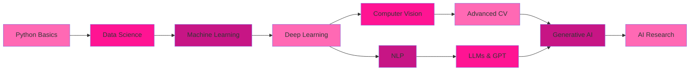

---

<table>
<tr>
<td width="50%" valign="top">

## 💜 About Me

Hi! I am **19 years old** AI Engineering student with a deep passion for **artificial intelligence**, **machine learning**, and creating intelligent systems that solve real-world problems.

I love exploring **neural networks**, **computer vision**, **NLP**, and building AI models that make an impact! 🚀

</td>
<td width="50%" valign="top">

###  Profile Image

  

</td>
</tr>
</table>

---

<table>
<tr>
<td width="60%" valign="top">

## 🎓 Education

⭐ **10th CBSE**
⭐ **12th CBSE**
⭐ **Bachelor's Degree** - Computer Science/AI
⭐ **AI & Machine Learning** - Online Courses
⭐ **Deep Learning Specialization**
⭐ **Data Science Bootcamp**

### 📚 Certifications
- 🏅 TensorFlow Developer Certificate
- 🏅 Machine Learning by Andrew Ng
- 🏅 Deep Learning Specialization
- 🏅 Kaggle Competitions

</td>
<td width="100%" valign="top">

## 💎 Skills

✨ **Machine Learning**
✨ **Deep Learning**
✨ **Computer Vision**
✨ **Natural Language Processing**
✨ **Neural Networks**
✨ **Data Analysis**
✨ **Model Deployment**
✨ **MLOps**

### 🔧 Core Competencies
- Supervised & Unsupervised Learning
- Transfer Learning
- Model Optimization
- Feature Engineering

</td>
</tr>
</table>
<table>
  <tr>
    <td width="50%" valign="top">

## 💻 Programming Languages

---

## 🧠 AI/ML Frameworks & Libraries

### 🔥 Deep Learning Frameworks

### 📊 Data Science & Analysis

### 🤗 NLP & Transformers

### 👁️ Computer Vision

---

## 🗄️ Databases & Data Storage

### 📦 Data Warehousing & Big Data

---

## 🛠️ Tools & Technologies

### 💼 Development Tools

### ☁️ Cloud & Deployment

### 🔄 MLOps & Version Control

---

<table>
<tr>
<td width="100%" valign="top">

 

> **🎵 Music Lover**
 

 

> **📚 Reading Tech Blogs**
 

 

> **🎮 Exploring AI Tools**
 

 

> **🎬 Watching Tech Videos**
 

 

> **🌐 Open Source**
 

 

> **☕ Coffee & Code**
 

</td>

</tr>
</table>

## 📈 GitHub Statistics

  

     

## 📈 Learning Path

---

## 🤝 Let's Connect & Collaborate!

**I'm always open to:**
 🤝 Collaborating on AI/ML projects
 💡 Discussing research papers
 🎓 Sharing knowledge and learning
 🚀 Building innovative AI solutions
 🌟 Contributing to open source

### 📧 Contact Information

**Primary Email:** ulfiah525363@gmail.com

